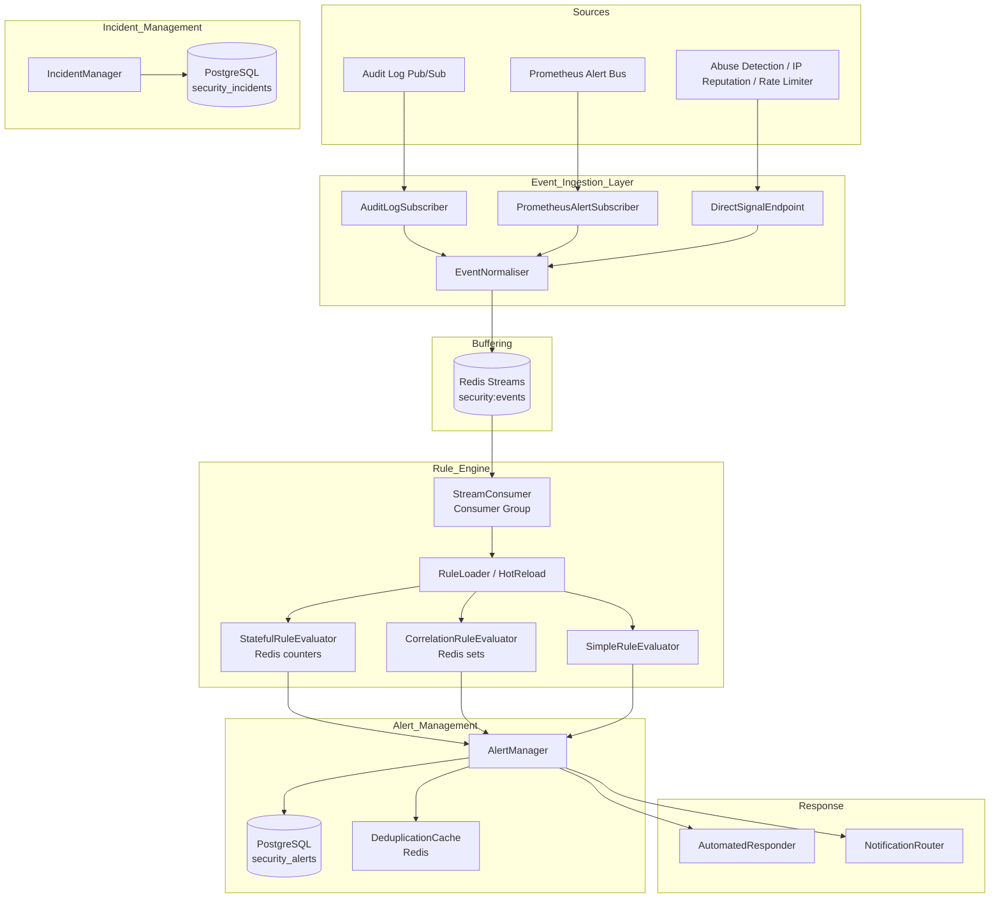

# Design Document: Security Event Detection

## Overview

The Security Event Detection system is a real-time threat detection, alert management, and automated response subsystem for the Aframp platform. It ingests events from three sources — the audit log pub/sub stream, Prometheus alert firings, and direct security signal pushes — normalises them into a common schema, evaluates them against a configurable rule library, and manages the full lifecycle of security alerts and incidents.

The system is implemented as a new top-level module `src/security/` within the existing Rust workspace. It integrates with the existing Redis cache layer (`src/cache/`), Prometheus metrics registry (`src/metrics/`), admin access control system (`src/admin/`), and the structured logging infrastructure (`tracing` crate). All background processing runs as Tokio tasks following the same `run(shutdown: watch::Receiver<bool>)` pattern used by existing workers in `src/workers/`.

### Design Goals

- Sub-second detection latency from event ingestion to alert creation for high-severity rules
- Zero event loss under temporary Rule Engine lag via Redis Streams buffering
- Hot-reloadable rule definitions without service restart
- Automated response actions for high-confidence detections with admin override capability
- Full observability via the existing Prometheus registry and structured `tracing` log events

---

## Architecture



The system is structured around a unidirectional pipeline: ingest → buffer → evaluate → alert → respond. Each stage is decoupled via the Redis Streams buffer, allowing independent scaling and backpressure handling.

---

## Components and Interfaces

### 2.1 Event Ingestion Layer (`src/security/ingestion/`)

Three subscriber/handler types feed into a shared `EventNormaliser`:

**`AuditLogSubscriber`** — subscribes to the Redis pub/sub channel established in issue #98. Uses the existing `bb8-redis` connection pool. Implements exponential backoff reconnection (initial 1s, max 30s, factor 2×) using `tokio::time::sleep`. Tracks the last acknowledged stream offset in Redis so resumption after failure is lossless.

**`PrometheusAlertSubscriber`** — subscribes to an internal `tokio::sync::broadcast` channel that carries `PrometheusAlertFiring` events from the existing metrics infrastructure. Filters by a configurable rule name allowlist.

**`DirectSignalEndpoint`** — an Axum handler mounted at an internal route (not exposed externally). Accepts `SecuritySignalPush` payloads from the abuse detection, IP reputation, and rate limiting systems. Validates the payload against the `SecuritySignalPush` schema before forwarding to the normaliser.

**`EventNormaliser`** — converts any inbound event type into a `SecurityEvent` struct. Sets sentinel values (`"unknown"` for string fields, `Severity::Info` for severity) when fields cannot be derived. Writes the normalised event to the Redis Streams key `security:events` using `XADD ... MAXLEN ~ <configured_max>`.

### 2.2 Rule Engine (`src/security/rules/`)

**`RuleLoader`** — loads `DetectionRule` definitions from a TOML/YAML file path (configurable via `[security.rules_path]` in `config/*.toml`). Polls for changes at a configurable interval (default 30s, max 60s) by comparing file modification time. On change, atomically swaps the active rule set via `Arc<RwLock<Vec<DetectionRule>>>`.

**`StreamConsumer`** — reads from `security:events` using Redis Streams consumer group `security-rule-engine`. Uses `XREADGROUP` with a configurable `COUNT` and `BLOCK` timeout. Acknowledges events with `XACK` after successful evaluation. Pending entries (unacknowledged beyond `PEL_TIMEOUT`) are reclaimed via `XAUTOCLAIM`.

**`SimpleRuleEvaluator`** — evaluates event-driven rules (no aggregation window). Checks `event_type_filters` and `field_match_conditions` against the incoming `SecurityEvent`. Fires immediately when all conditions match.

**`StatefulRuleEvaluator`** — maintains per-`(rule_id, actor_identity)` counters in Redis using `INCR` with `EXPIRE` set to `aggregation_window`. For distinct-value tracking rules, uses Redis `SADD` + `SCARD` on a set key with the same TTL. Fires when the counter/cardinality reaches `threshold`.

**`CorrelationRuleEvaluator`** — maintains per-`(rule_id, actor_identity)` source sets in Redis using `SADD` with `EXPIRE` set to `aggregation_window`. Fires when `SCARD` equals `len(required_sources)`. Collects contributing event IDs in a parallel Redis list.

### 2.3 Alert Manager (`src/security/alerts/`)

**`AlertManager`** — creates, deduplicates, and manages the lifecycle of `Alert` records in PostgreSQL. Deduplication uses a Redis key `dedup:{rule_id}:{actor_identity}` with TTL = `deduplication_window`. Exposes HTTP handlers for the lifecycle endpoints mounted under `/api/admin/security/alerts/`.

**`EscalationWorker`** — a background Tokio task that polls for `high`-severity open Alerts whose `created_at` exceeds `acknowledgement_timeout` and auto-escalates them. Runs on a configurable interval (default 60s).

### 2.4 Incident Manager (`src/security/incidents/`)

**`IncidentManager`** — manages `SecurityIncident` records. Exposes HTTP handlers for `/api/admin/security/incidents/`. Appends timeline entries atomically using a PostgreSQL `JSONB` array append.

### 2.5 Automated Responder (`src/security/response/`)

**`AutomatedResponder`** — listens on an internal `tokio::sync::mpsc` channel for `AutomatedResponseRequest` messages sent by the `AlertManager` when high-confidence rules fire. Dispatches to the appropriate action handler. Records each action in the `response_actions` JSONB column of the alert. Supports admin override via the `/override-response` endpoint.

### 2.6 Notification Router (`src/security/notifications/`)

**`NotificationRouter`** — routes alerts to the correct channel based on severity. Implements a `NotificationBackend` trait with concrete implementations for PagerDuty, Slack, and email. Retries failed deliveries with exponential backoff (3 attempts, initial 5s, factor 2×).

```rust
#[async_trait]
pub trait NotificationBackend: Send + Sync {
    async fn deliver(&self, notification: &Notification) -> Result<(), NotificationError>;
    fn name(&self) -> &'static str;
}
```

---

## Data Models

### `SecurityEvent`

```rust
pub struct SecurityEvent {
    pub event_id:        Uuid,
    pub event_type:      String,
    pub severity:        Severity,
    pub source_system:   String,
    pub actor_identity:  String,
    pub target_resource: String,
    pub event_detail:    serde_json::Value,
    pub timestamp:       DateTime<Utc>,
}

pub enum Severity { Info, Low, Medium, High, Critical }
```

### `DetectionRule`

```rust
pub struct DetectionRule {
    pub rule_id:                Uuid,
    pub rule_name:              String,
    pub rule_category:          RuleCategory,
    pub event_type_filters:     Vec<String>,
    pub field_match_conditions: HashMap<String, serde_json::Value>,
    pub aggregation_window:     Duration,    // 0 = event-driven (no window)
    pub threshold:              u32,
    pub severity_level:         Severity,
    pub response_action:        Option<ResponseAction>,
    pub deduplication_window:   Duration,    // default 300s
    pub required_sources:       Vec<String>, // non-empty only for Correlation rules
    pub distinct_field:         Option<String>, // for distinct-value stateful rules
}

pub enum RuleCategory {
    AuthenticationAnomaly, CredentialAbuse, TransactionFraud,
    AccessControlViolation, DataAccessAnomaly, InfrastructureAnomaly,
    CoordinatedAttack,
}

pub enum ResponseAction {
    TightenRateLimit,
    RevokeOAuthTokenFamily,
    TerminateAdminSessions,
    ActivateElevatedRateLimiting,
}
```

### `Alert`

```rust
pub struct Alert {
    pub alert_id:             Uuid,
    pub rule_id:              Uuid,
    pub severity:             Severity,
    pub status:               AlertStatus,
    pub assigned_admin_id:    Option<Uuid>,
    pub related_event_ids:    Vec<Uuid>,
    pub actor_identity:       String,
    pub created_at:           DateTime<Utc>,
    pub resolution_timestamp: Option<DateTime<Utc>>,
    pub response_actions:     Vec<ResponseActionRecord>,
}

pub enum AlertStatus { Open, Acknowledged, Escalated, Resolved, FalsePositive }

pub struct ResponseActionRecord {
    pub action_type:       String,
    pub target:            String,
    pub executed_at:       DateTime<Utc>,
    pub executed_by:       String,       // admin UUID or "system"
    pub override_admin_id: Option<Uuid>,
}
```

### `SecurityIncident`

```rust
pub struct SecurityIncident {
    pub incident_id: Uuid,
    pub severity:    Severity,
    pub status:      IncidentStatus,
    pub alert_ids:   Vec<Uuid>,
    pub description: String,
    pub created_at:  DateTime<Utc>,
    pub timeline:    Vec<TimelineEntry>,
}

pub struct TimelineEntry {
    pub action_type: String,
    pub actor_id:    Uuid,
    pub timestamp:   DateTime<Utc>,
    pub notes:       Option<String>,
}
```

### Database Schema (new migrations)

```sql
-- security_events (append-only log, partitioned by month)
CREATE TABLE security_events (
    event_id        UUID PRIMARY KEY DEFAULT gen_random_uuid(),
    event_type      TEXT NOT NULL,
    severity        TEXT NOT NULL,
    source_system   TEXT NOT NULL,
    actor_identity  TEXT NOT NULL,
    target_resource TEXT NOT NULL,
    event_detail    JSONB NOT NULL DEFAULT '{}',
    timestamp       TIMESTAMPTZ NOT NULL
) PARTITION BY RANGE (timestamp);

-- security_alerts
CREATE TABLE security_alerts (
    alert_id             UUID PRIMARY KEY DEFAULT gen_random_uuid(),
    rule_id              UUID NOT NULL,
    severity             TEXT NOT NULL,
    status               TEXT NOT NULL DEFAULT 'open',
    assigned_admin_id    UUID REFERENCES admin_accounts(id),
    related_event_ids    UUID[] NOT NULL DEFAULT '{}',
    actor_identity       TEXT NOT NULL,
    created_at           TIMESTAMPTZ NOT NULL DEFAULT now(),
    resolution_timestamp TIMESTAMPTZ,
    response_actions     JSONB NOT NULL DEFAULT '[]'
);
CREATE INDEX idx_security_alerts_status_severity ON security_alerts(status, severity);
CREATE INDEX idx_security_alerts_created_at ON security_alerts(created_at DESC);
CREATE INDEX idx_security_alerts_rule_actor ON security_alerts(rule_id, actor_identity);

-- security_incidents
CREATE TABLE security_incidents (
    incident_id UUID PRIMARY KEY DEFAULT gen_random_uuid(),
    severity    TEXT NOT NULL,
    status      TEXT NOT NULL DEFAULT 'open',
    alert_ids   UUID[] NOT NULL DEFAULT '{}',
    description TEXT NOT NULL,
    created_at  TIMESTAMPTZ NOT NULL DEFAULT now(),
    timeline    JSONB NOT NULL DEFAULT '[]'
);
```

### Redis Key Schema

| Key pattern | Type | TTL | Purpose |
|---|---|---|---|
| `security:events` | Stream | MAXLEN trim | Event buffer |
| `sec:state:{rule_id}:{actor}` | String (counter) | aggregation_window | Stateful rule counter |
| `sec:distinct:{rule_id}:{actor}` | Set | aggregation_window | Distinct-value tracking |
| `sec:corr:{rule_id}:{actor}:sources` | Set | aggregation_window | Correlation source set |
| `sec:corr:{rule_id}:{actor}:events` | List | aggregation_window | Contributing event IDs |
| `dedup:{rule_id}:{actor}` | String | deduplication_window | Deduplication lock |
| `sec:audit_offset` | String | none | Last acknowledged pub/sub offset |

---

## Correctness Properties

*A property is a characteristic or behavior that should hold true across all valid executions of a system — essentially, a formal statement about what the system should do. Properties serve as the bridge between human-readable specifications and machine-verifiable correctness guarantees.*

### Property 1: Event Normalisation Completeness

*For any* valid inbound event from any source system (audit log, Prometheus, direct push), the resulting `SecurityEvent` must contain non-empty values for all required fields (`event_type`, `severity`, `source_system`, `actor_identity`, `target_resource`, `timestamp`), and the original payload must be recoverable from `event_detail` without modification.

**Validates: Requirements 1.2, 2.3, 2.4, 3.2, 4.1, 4.4**

### Property 2: Sentinel Value on Missing Field

*For any* inbound event where one or more required fields cannot be derived, the normalised `SecurityEvent` must have those fields set to their defined sentinel values (`"unknown"` for strings, `Severity::Info` for severity), and the event must still be written to the Redis stream.

**Validates: Requirements 4.3**

### Property 3: Exponential Backoff Bounds

*For any* sequence of reconnection attempts after a connection failure, each successive backoff interval must be at least double the previous interval, and no interval may exceed 30 seconds.

**Validates: Requirements 1.3, 25.5**

### Property 4: Rule Evaluation Filter Correctness

*For any* `SecurityEvent` and set of `DetectionRule`s, only rules whose `event_type_filters` contain the event's `event_type` (or whose filter list is empty, meaning match-all) must be evaluated; all other rules must be skipped.

**Validates: Requirements 7.1**

### Property 5: Threshold Firing

*For any* `DetectionRule` with threshold T and aggregation window W, and any sequence of T matching `SecurityEvent`s for the same `actor_identity` within W, exactly one `Alert` must be produced and the state counter must be reset to zero after firing.

**Validates: Requirements 7.3, 8.2, 8.3, 8.4**

### Property 6: Distinct-Value Stateful Rule

*For any* stateful rule configured with a `distinct_field`, the state counter must increment only when a new distinct value for that field is observed for the `(rule_id, actor_identity)` pair within the aggregation window; repeated identical values must not increment the counter.

**Validates: Requirements 8.5**

### Property 7: Correlation Rule Firing

*For any* `Correlation_Rule` with `required_sources` S, and any sequence of matching events for the same `actor_identity` where every source in S has contributed at least one event within the aggregation window, exactly one `Alert` must be produced containing the IDs of all contributing events in `related_event_ids`.

**Validates: Requirements 9.2, 9.3, 9.4**

### Property 8: Hot-Reload Rule Application

*For any* rule definition change detected by the `RuleLoader`, all `SecurityEvent`s processed after the reload completes must be evaluated against the updated rule set; events processed before the reload must not be re-evaluated.

**Validates: Requirements 10.2, 10.3, 10.4**

### Property 9: Alert Record Completeness

*For any* `DetectionRule` firing, the resulting `Alert` record must contain a non-null `alert_id` (UUID), `rule_id`, `severity`, `status = Open`, `created_at`, and a non-empty `related_event_ids` list.

**Validates: Requirements 18.1, 18.2**

### Property 10: Alert Deduplication Suppression

*For any* two rule firings for the same `(rule_id, actor_identity)` pair where the second firing occurs within the `deduplication_window` of the first, no new `Alert` record must be created; instead, the new event IDs must be appended to the existing Alert's `related_event_ids`.

**Validates: Requirements 19.1, 19.4**

### Property 11: Alert Lifecycle State Machine

*For any* `Alert`, the following state transitions must be the only valid ones: `Open → Acknowledged`, `Open → Escalated`, `Open → Resolved`, `Open → FalsePositive`, `Acknowledged → Escalated`, `Acknowledged → Resolved`, `Acknowledged → FalsePositive`, `Escalated → Resolved`, `Escalated → FalsePositive`. Any attempt to transition from `Resolved` or `FalsePositive` must be rejected with HTTP 409.

**Validates: Requirements 20.1, 20.3, 21.1, 22.1, 22.2, 23.1**

### Property 12: Escalation Severity Increment

*For any* `Alert` with severity S where S ≠ `Critical`, escalating must produce an Alert with severity equal to the next level above S. Escalating a `Critical` Alert must be rejected with HTTP 422.

**Validates: Requirements 21.1, 21.2**

### Property 13: Metrics Monotonicity

*For any* sequence of system operations, the counters `aframp_security_events_ingested_total`, `aframp_security_rules_evaluated_total`, `aframp_security_alerts_fired_total`, `aframp_security_automated_responses_total`, `aframp_security_false_positives_total`, and `aframp_security_alerts_deduplicated_total` must be monotonically non-decreasing, and each must increment by exactly 1 for each corresponding operation.

**Validates: Requirements 7.2, 18.3, 19.3, 28.4, 32.1–32.5**

### Property 14: Automated Response Cause-Effect

*For any* `Alert` produced by a rule with an associated `ResponseAction`, the `AutomatedResponder` must execute exactly the action specified by the rule and record it in the Alert's `response_actions` list with `executed_by = "system"` before the Alert is returned to any API caller.

**Validates: Requirements 28.1, 28.2, 29.1, 29.2, 30.1, 30.2, 31.1, 31.2**

### Property 15: Incident Timeline Append-Only

*For any* `SecurityIncident`, every response action, escalation, or resolution note recorded against it must result in a new `TimelineEntry` being appended to the incident's `timeline` array; no existing entries may be modified or removed.

**Validates: Requirements 27.5**

### Property 16: Notification Severity Routing

*For any* `Alert`, the notification channel selected by the `NotificationRouter` must match the severity routing table: `critical`/`high` → on-call channel; `medium` → security team channel; `low`/`info` → daily digest.

**Validates: Requirements 25.1, 25.2, 25.3**

### Property 17: Structured Log Field Completeness

*For any* significant security system action (Alert created, escalated, acknowledged, resolved, automated response executed), the emitted structured log event must contain all fields specified in Requirements 33.1–33.5 at the correct log level.

**Validates: Requirements 33.1–33.5**

---

## Error Handling

### Ingestion Errors

- **Schema validation failure** (direct signal push): return `400 Bad Request` with a structured error body; increment `aframp_security_events_ingestion_errors_total{source_system}`.
- **Redis write failure** (stream append): log at ERROR with `tracing::error!`; increment `aframp_worker_errors_total{worker="security_ingestion", error_type="redis_write"}`; retry up to 3 times with 100ms backoff before discarding.
- **Pub/sub disconnection**: reconnect with exponential backoff (1s → 2s → 4s → … → 30s max). Log each attempt at WARN level.

### Rule Engine Errors

- **Invalid rule definition at load time**: log structured error with `rule_id` and reason; skip the rule; continue loading remaining rules.
- **Redis state operation failure** (INCR, SADD, etc.): log at ERROR; skip firing for this event; do not crash the consumer loop.
- **Consumer group lag**: expose via `aframp_security_rule_engine_processing_lag_seconds` gauge; fire `SecurityRuleEngineLagHigh` Prometheus alert when lag exceeds threshold.

### Alert Manager Errors

- **Database write failure**: return `500 Internal Server Error`; log at ERROR with `alert_id` and error details.
- **Deduplication Redis failure**: fail-open (create a new Alert) to avoid silently dropping alerts; log at WARN.

### Automated Responder Errors

- **Action execution failure**: log at ERROR; record the failure in `response_actions` with `status = "failed"`; do not retry automatically (requires admin intervention).
- **Override after action already executed**: return `409 Conflict` with the already-executed action details.

### Notification Router Errors

- **Delivery failure after 3 retries**: log structured error at ERROR level; increment `aframp_worker_errors_total{worker="notification_router", error_type="delivery_failed"}`; do not block Alert creation.

---

## Testing Strategy

### Unit Tests (`src/security/*/tests.rs`)

Unit tests focus on pure logic exercisable without infrastructure:

- **Normalisation**: each source type produces a correctly-shaped `SecurityEvent`; sentinel values are set for missing fields; `event_detail` round-trip.
- **Rule evaluation**: `SimpleRuleEvaluator` fires on matching events and does not fire on non-matching events; threshold boundary (T-1 events → no fire, T events → fire).
- **State counter logic**: counter reset after firing; distinct-value deduplication.
- **Correlation logic**: partial state does not fire; all-sources-present fires; contributing event IDs are collected.
- **Alert lifecycle state machine**: all valid transitions succeed; all invalid transitions return the correct HTTP error.
- **Escalation severity increment**: each severity level increments correctly; `Critical` returns 422.
- **Deduplication window**: suppression within window; new Alert allowed after window expiry.
- **Backoff algorithm**: intervals are bounded by 30s and grow exponentially.
- **Notification routing**: severity-to-channel mapping for all five severity levels.

### Property-Based Tests (`src/security/*/property_tests.rs`)

Property tests use the [`proptest`](https://crates.io/crates/proptest) crate. Each test runs a minimum of 100 iterations.

```toml
# Add to Cargo.toml [dev-dependencies]
proptest = "1"
```

Each property test is tagged with a comment referencing the design property it validates:
`// Feature: security-event-detection, Property N: <property_text>`

**Property 1 — Event Normalisation Completeness**
Generate arbitrary `RawAuditLogEvent`, `PrometheusAlertFiring`, and `DirectSignalPush` values. Assert that `normalise(event)` returns `Ok(SecurityEvent)` with all required fields non-empty and `event_detail` equal to the original payload.

**Property 2 — Sentinel Value on Missing Field**
Generate events with randomly omitted fields. Assert that the normalised event has sentinel values for missing fields and is still written to the stream.

**Property 3 — Exponential Backoff Bounds**
Generate a random number of reconnection attempts (1–20). Assert that each interval is ≤ 30s and that `interval[n] >= 2 * interval[n-1]` for all n > 0.

**Property 4 — Rule Evaluation Filter Correctness**
Generate a random `SecurityEvent` and a random set of `DetectionRule`s. Assert that `evaluate(event, rules)` only invokes the evaluator for rules where `event_type_filters` contains `event.event_type`.

**Property 5 — Threshold Firing**
Generate a random `DetectionRule` with threshold T (1–100) and a sequence of T matching events for the same actor. Assert that exactly one Alert is produced and the counter is reset to 0.

**Property 6 — Distinct-Value Stateful Rule**
Generate a random distinct-field rule and a sequence of events with repeated and unique field values. Assert that the counter equals the number of distinct values seen, not the total event count.

**Property 7 — Correlation Rule Firing**
Generate a random `Correlation_Rule` with 2–5 required sources and a sequence of events covering all sources. Assert that exactly one Alert is produced with all contributing event IDs present.

**Property 8 — Hot-Reload Rule Application**
Generate two rule sets (before and after reload) and two event sequences (before and after reload). Assert that post-reload events are evaluated against the new rule set only.

**Property 9 — Alert Record Completeness**
Generate arbitrary rule firings. Assert that every resulting Alert has all required fields populated with valid values.

**Property 10 — Alert Deduplication Suppression**
Generate a random Alert and a second firing within the deduplication window. Assert that no new Alert is created and the existing Alert's `related_event_ids` grows.

**Property 11 — Alert Lifecycle State Machine**
Generate random sequences of lifecycle operations on an Alert. Assert that only valid transitions succeed and invalid transitions return HTTP 409/422.

**Property 12 — Escalation Severity Increment**
Generate random Alerts with severity in `[Info, Low, Medium, High]`. Assert that escalation produces the next severity level. Generate Alerts with `Critical` severity and assert escalation returns HTTP 422.

**Property 13 — Metrics Monotonicity**
Generate random sequences of system operations. Assert that all counters are non-decreasing and increment by exactly 1 per operation.

**Property 14 — Automated Response Cause-Effect**
Generate random Alerts for rules with each `ResponseAction` variant. Assert that the correct action is executed and recorded in `response_actions` with `executed_by = "system"`.

**Property 15 — Incident Timeline Append-Only**
Generate random sequences of incident updates. Assert that the timeline length is monotonically increasing and no existing entries are modified.

**Property 16 — Notification Severity Routing**
Generate random Alerts with each severity level. Assert that the notification is routed to the correct channel.

**Property 17 — Structured Log Field Completeness**
Generate random Alert lifecycle events. Assert that the emitted log record contains all required fields at the correct level.

### Integration Tests (`tests/security_*.rs`)

Integration tests run against a real PostgreSQL + Redis instance (same pattern as `tests/cache_integration_test.rs`):

- **End-to-end detection** for at least one rule from each of the seven rule categories (Req 35.1)
- **Full Alert lifecycle**: creation → acknowledgement → escalation → resolution → false positive (Req 35.2)
- **Notification routing** to each channel type (Req 35.3)
- **Automated response** end-to-end for each `ResponseAction` variant (Req 35.4)
- **Incident management**: create, update, timeline append (Req 35.5)
- **Hot-reload**: update rule file, wait one poll interval, verify new rule applies to subsequent events without event loss (Req 35.6)
